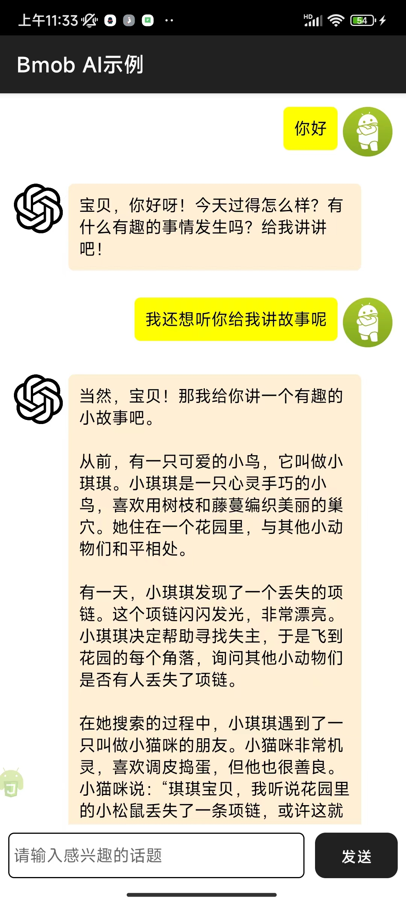

# Bmob-Android-AI
Bmob安卓AI示例

## 最终效果




## 创建AI类
```java
bmobAI = new BmobAI();
```

## 请求AI

```java
bmobAI.Chat(quesion, "test_user",new ChatMessageListener() {
    @Override
    public void onMessage(String s) {
        //消息流的形式返回AI的结果
        Log.d("ai",s);
    }
    @Override
    public void onFinish(String s) {
        //一次性返回全部结果，这个方法需要等待一段时间，友好性较差
        Log.d("ai",s);
    }

    @Override
    public void onClose() {
        //连接关闭了
        Log.d("ai","close");
    }
});
```

## 设置prompt

```java
bmobAI.setPrompt("在请求AI前调用");
```
